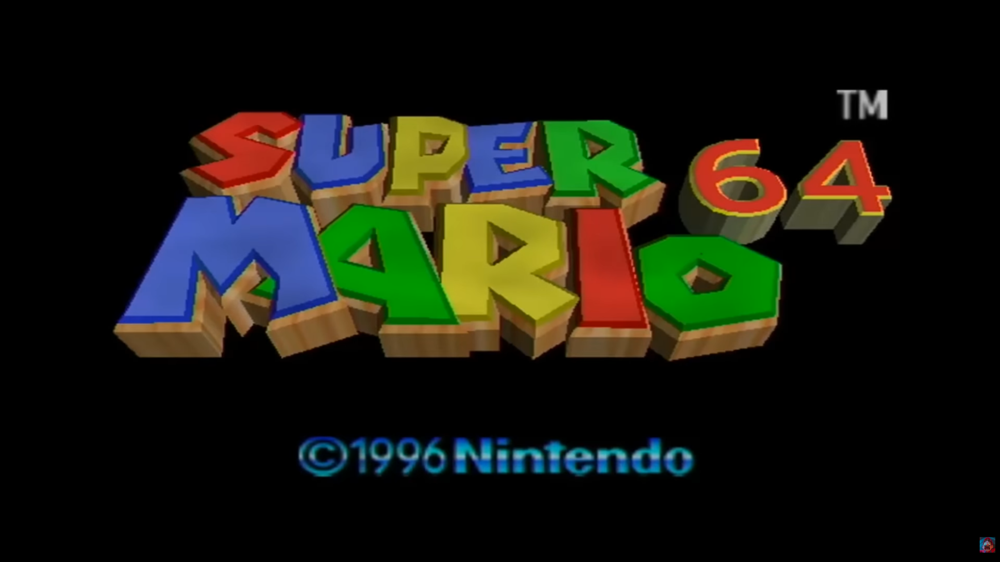
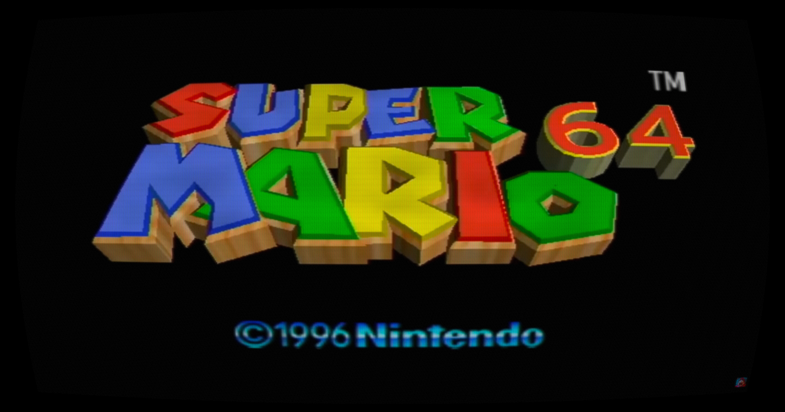
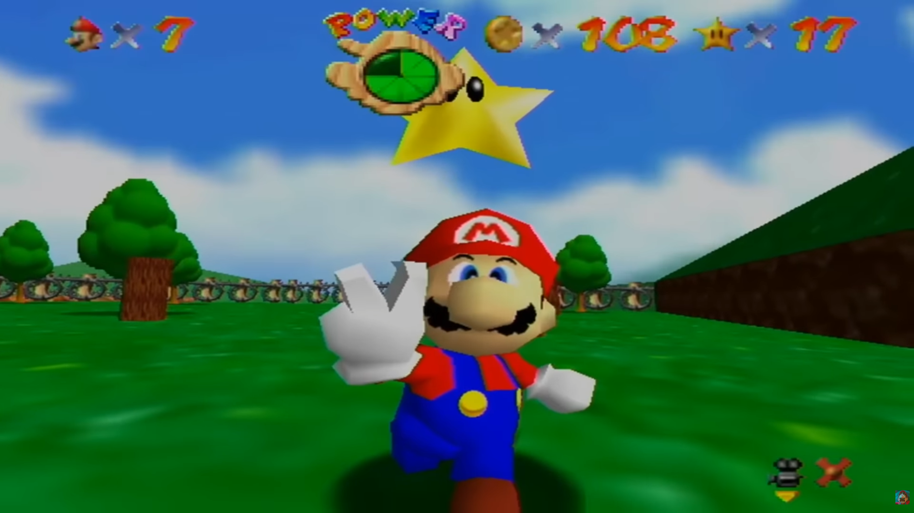
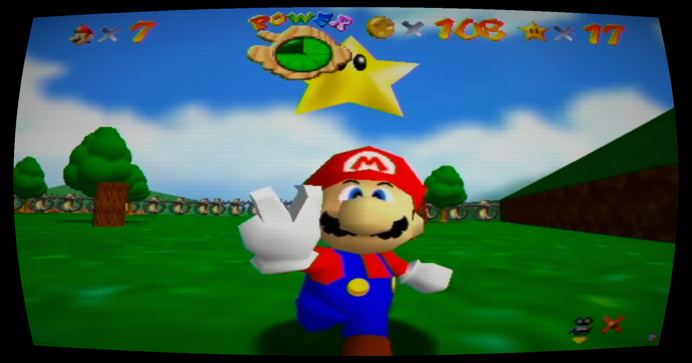

# SeeRT Overlay

It's a Saturday afternoon, and you have the hankering to play a classic game from your childhood - Super Mario 64! You boot up the game on your PC and notice the characters look a little too "angular" for your nostalgia causing the experience lack some of the character from days gone by.

Wouldn't it be nice to view retro media in the format it was designed to be played/viewed in? Wouldn't it be nice to make your very nice 4k monitor wildly antiquated? Wouldn't it be nice for you monitor to still have scanlines and static to further distort your view? 

Well me too! Enter - SeeRT!

## A short forward...
I've been in my "better practice an agentic workflow within development to stay up with the times" arc, so this project was prompted probably 90% using Claude, me only tweaking a few things here and there and running a few commands when Claude seemed to get stuck.

## What is it?
A Windows CRT monitor overlay that applies a real-time shader filter over any window or monitor. The filter runs in a transparent, click-through DirectComposition overlay — the target application sees no performance impact and requires no modification.


<table>
  <tr>
    <td align="center"><b>Before</b></td>
    <td align="center"><b>After</b></td>
  </tr>
  <tr>
    <td></td>
    <td></td>
  </tr>
  <tr>
    <td></td>
    <td></td>
  </tr>
</table>

(P.S. I didn't want to boot my emulator for this, but thanks to "packattack04082"
on youtube for the gameplay I got my screenshots from!)


## Features

**Shader pipeline** (RetroArch-inspired, gamma-correct)
- Barrel/pincushion distortion with zoom compensation
- Gaussian beam scanlines with luminance-dependent spread
- Shadow mask — aperture grille, shadow mask dots, and slot mask patterns (anti-aliased)
- Phosphor bloom and diffusion
- RGB convergence error (chromatic aberration)
- Vignette, hum bar, flicker, and TV static
- Phosphor tint (R/G/B) for monochrome terminal looks
- Colour grading — brightness, contrast, saturation

**Overlay**
- Captures any window or monitor via Windows Graphics Capture
- Click-through when settings panel is closed; receives input when open
- Multi-monitor: add secondary overlays to additional monitors
- Custom CRT cursor rendered inside the shader (barrel-distorted with the image)
- Shake mouse to reveal cursor and settings toggle button
- System tray icon

**Settings**
- ImGui settings panel with multiple UI themes
- 11 built-in presets + save/load/reorder user presets
- Settings persist to `%APPDATA%\SeeRT Overlay\settings.json`
- Audio loopback capture (optional)

## Built-in Presets

| Preset | Character |
|---|---|
| Default | Balanced starting point |
| Early 2000s Laptop | Subtle, LCD-era hint of CRT |
| Arcade | Bold cabinet look — heavy scanlines, strong mask |
| Green Phosphor | P31 monochrome terminal |
| Amber Phosphor | P3 amber/orange terminal |
| Heavy CRT | Degraded 1980s boxy TV |
| crt-geom | Classic RetroArch reference implementation |
| crt-lottes | Tim Lottes' shader — crisp, fine slot mask |
| Sony PVM | Professional reference monitor, minimal artifacts |
| Trinitron | Flat aperture-grille tube, SNES/PS1 era |
| NTSC Composite | Degraded consumer signal with convergence error |

## Requirements

- Windows 10 or later
- [Visual Studio 2022+ Build Tools](https://visualstudio.microsoft.com/downloads/#build-tools-for-visual-studio-2022) with the **Desktop development with C++** workload
- [Windows SDK 10.0.26100+](https://developer.microsoft.com/en-us/windows/downloads/windows-sdk/)
- [vcpkg](https://github.com/microsoft/vcpkg) installed and available (e.g. `C:/vcpkg`)

## Building

1. Clone the repo and open a terminal in the project root.

2. If vcpkg is not at `C:/vcpkg`, edit `CMakePresets.json` and update `toolchainFile` to point to your vcpkg installation.

3. Configure and build:
   ```bash
   cmake --preset default
   cmake --build --preset default
   ```

4. The executable is at `build/bin/Release/SeeRT Overlay.exe`. Shader `.cso` files and font assets are copied next to it automatically.

Dependencies (`imgui`, `nlohmann-json`) are installed automatically from `vcpkg.json` during the configure step — no manual `vcpkg install` needed.

## Tech Stack

| Layer | Technology |
|---|---|
| Language | C++20 |
| Renderer | Direct3D 11 |
| Shaders | HLSL 5.0 (compiled via fxc.exe) |
| Screen capture | Windows Graphics Capture (C++/WinRT) |
| UI | Dear ImGui |
| Composition | DirectComposition |
| JSON | nlohmann/json |
| Package manager | vcpkg (manifest mode) |
